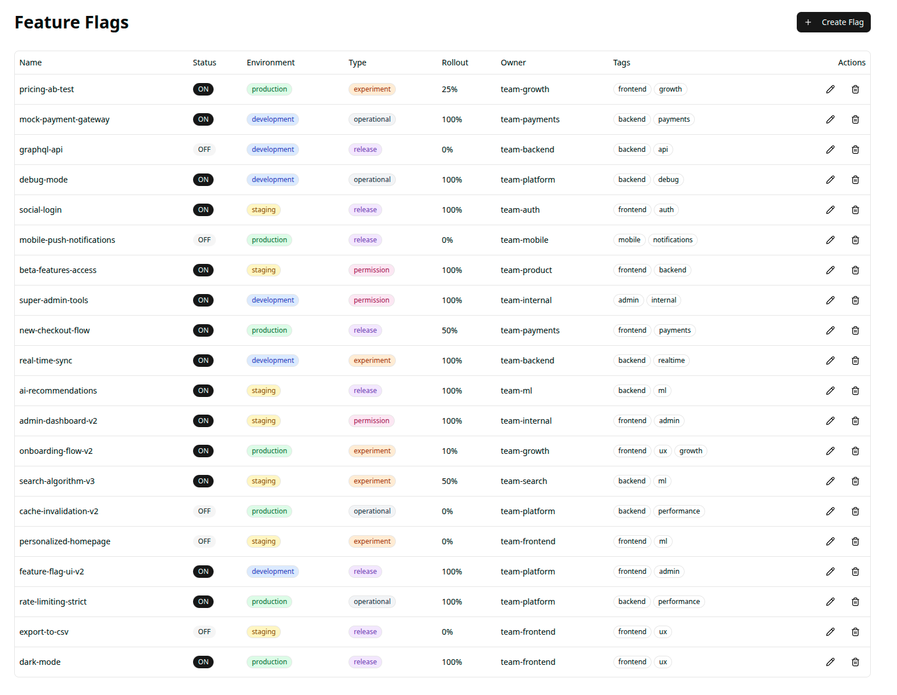
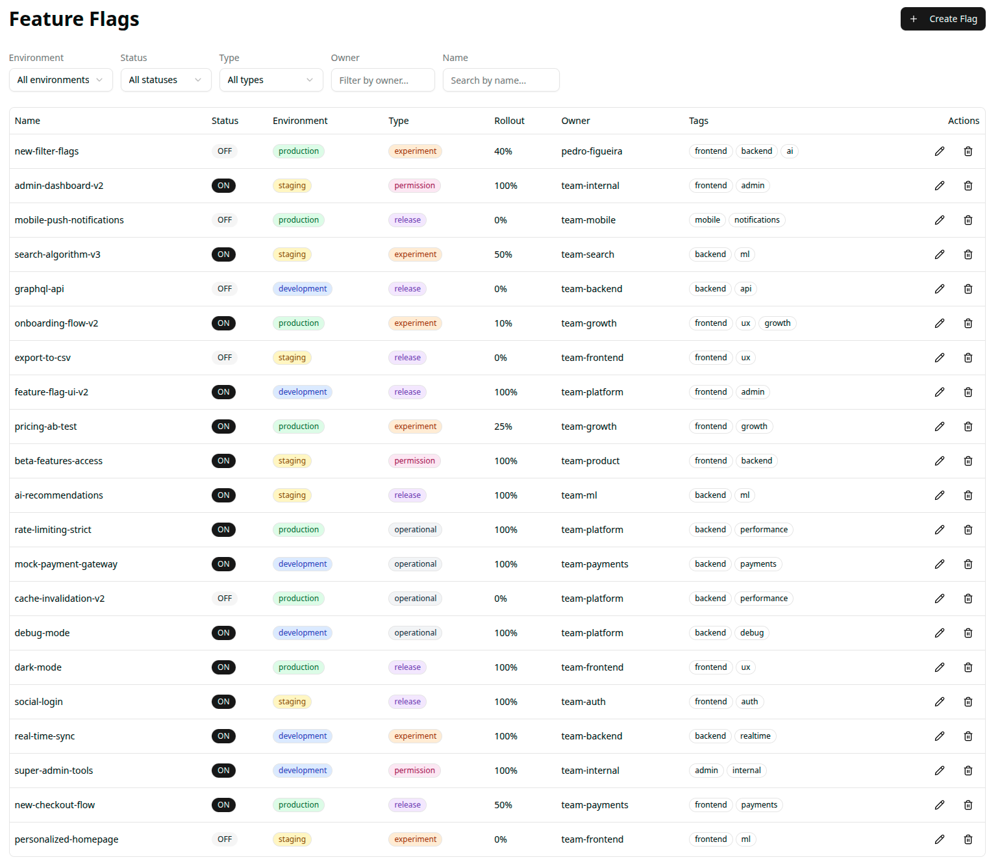

# Feature Flag Filtering

## Description

Our feature flag management dashboard is growing. With 20+ flags across multiple environments and teams, users are finding it difficult to locate specific flags quickly. We need to add filtering capabilities so users can narrow down the list based on various criteria.

Currently, the dashboard displays all flags in a single table with no way to filter or search. Users have reported that scrolling through the entire list to find a specific flag is time-consuming and error-prone, especially when they need to quickly toggle a flag during an incident.

## User Story

**As a** software engineer managing feature flags,
**I want to** filter flags by various attributes,
**So that I** can quickly find and manage the flags relevant to my current task.

## Acceptance Criteria

- [x] Users can filter flags by environment (development, staging, production)
- [x] Users can filter flags by status (enabled/disabled)
- [x] Users can filter flags by type (release, experiment, operational, permission)
- [x] Users can filter flags by owner
- [x] Users can search flags by name (partial match)
- [x] Filtering should happen in the backend
- [x] Multiple filters can be applied simultaneously (e.g., "all enabled release flags in production")
- [x] Filters persist while using other features (creating, editing, deleting flags)
- [x] There is a way to clear all filters and return to the full list
- [x] The UI clearly indicates when filters are active
- [x] Filtering should feel responsive, even as the number of flags grows

## Notes

- Consider where filtering logic should live for the best user experience
- Think about how filters interact with each other (AND vs OR logic)
- The filter UI should be intuitive and not clutter the interface

---

## Implementation — [Epic 1 Results](./docs/epics/Epic%201%20—%20Baseline%20Implementation:%20Feature%20Flag%20Filtering.md)

### Before

> No filtering capabilities. All flags displayed in a flat list with no controls.

### After

> Server-side filtering by environment, status, type, owner, and name. Active-filter badge and "Clear all filters" action. Filter state persists across create/edit/delete mutations. Text inputs include 300 ms debounce.

### Deliverables

| Artifact | Path |
|---|---|
| Closure report | [`.agents/closure/epic1-closure-report.md`](.agents/closure/epic1-closure-report.md) |
| Epic 2 handoff | [`.agents/closure/epic2-handoff.md`](.agents/closure/epic2-handoff.md) |
| Baseline metrics | [`.agents/baseline/measurement-baseline.md`](.agents/baseline/measurement-baseline.md) |
| Friction log | [`.agents/baseline/epic1-friction-log.md`](.agents/baseline/epic1-friction-log.md) |
