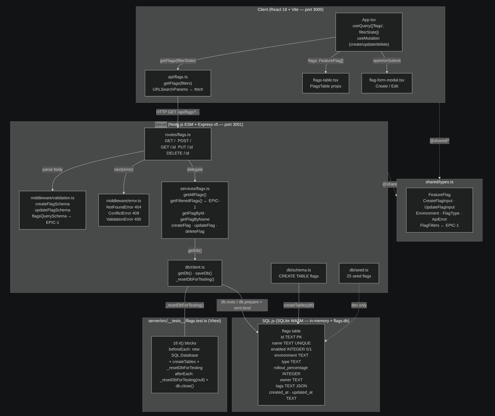
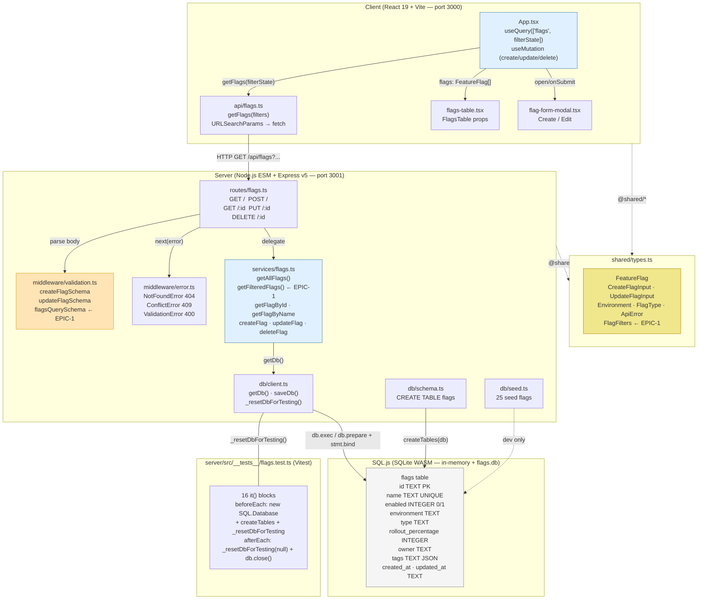

# Architecture Diagram — nextjs-feature-flag-exercise

> Data flow: `shared/types.ts` → Zod validation → Service → Routes → Client API → UI

**Nodes marked `← EPIC-1`** are not yet implemented and represent the filtering feature target (see [TASK.md](../TASK.md)).
